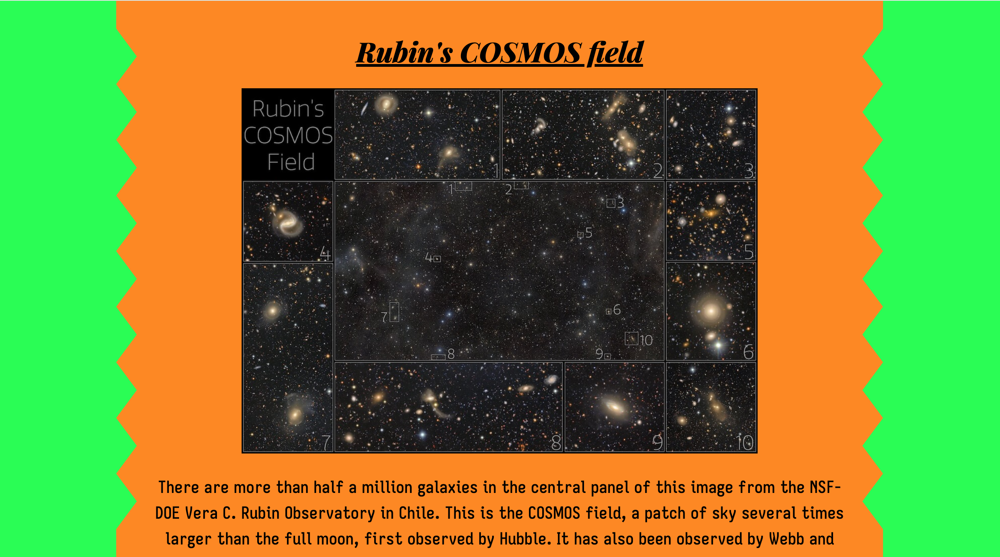

# AstroCU

A cool little website where you can view NASA's Astronomy Picture of The Day (APOD), but with a little surprise ;>) which you may yourself wanna check out!

I built this project as a part of the stardance program using their guide, but also brought my own design and features to it. 

This is a vite project and uses HTML, CSS and JS. 

**Experience the website here: [Website Link](https://ronit-serva.github.io/APOD-Surprise/)**

**PS;** *The twist is that you can view NASA's APOD from the day you were born be sharing your birthdate.*

Isn't it cool?!
